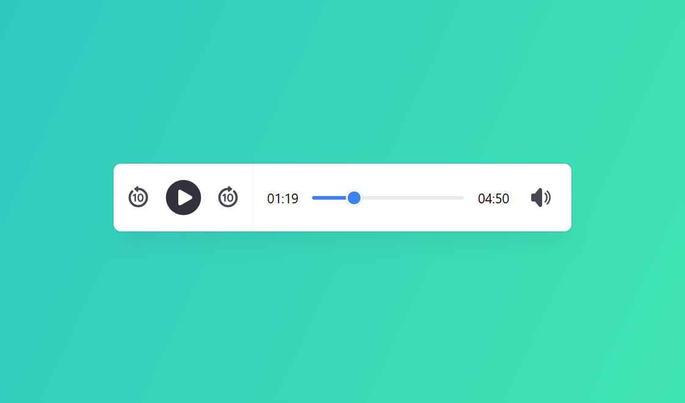

[<font size="4">**➥ Online Demo**</font>](https://avimodam.github.io/bamios-audio-player/)

# Bamios

Bamios - is a free and modern HTML5 JS Audio Player with high performance, lightweight, and compatible with most web browsers and devices.

# Quick setup

## HTML

Bamios extends upon the standard HTML5 media element markup.

```html
<div id="my-audio-player">
  <audio>
    <source src="path/to/audio.mp3" />
  </audio>
</div>
```

## CSS

Include the `bamios.min.css` (or `bamios.css`) stylesheet into your `<head>`.

```html
<link rel="stylesheet" href="path/to/bamios.min.css" />
```

## JavaScript

Include the `bamios.min.js` (or `bamios.js`) script before the closing `</body>` tag and then create a new instance of Bamios as below.

```html
<script src="path/to/bamios.min.js"></script>
<script>
  const player = new Bamios('#my-audio-player');
</script>
```

# Options

| Option            | Description                                                  | Value           | Default |
| ----------------- | ------------------------------------------------------------ | --------------- | ------- |
| pauseOthersOnPlay | Pause all other Bamios players when hitting the play button. | `true`, `false` | `true`  |

**<font size="3">Example of how to initialize Bamios player with options:</font>**

```html
<script>
  const player = new Bamios('#my-audio-player', {
    pauseOthersOnPlay: false,
  });
</script>
```

# Methods

| Method                                           | Description                                                                                                                                                                                                |
| ------------------------------------------------ | ---------------------------------------------------------------------------------------------------------------------------------------------------------------------------------------------------------- |
| player.play()                                    | Play audio player.                                                                                                                                                                                         |
| player.pause()                                   | Pause audio player.                                                                                                                                                                                        |
| player.stop()                                    | Stop audio player.                                                                                                                                                                                         |
| player.setCurrentTime(`second`)                  | Set the current time for audio player.<br><br><ul><li>`second` - number - Time (in second)</li></ul>                                                                                                       |
| player.setPauseOthersOnPlay(`pauseOthersOnPlay`) | Set the `pauseOthersOnPlay` option.<br><br><ul><li>`pauseOthersOnPlay` - boolean - Set it to false (by default it is true) and when hitting the play button other Bamios players will not pause.</li></ul> |

# Credits

List of audio files used in the demo.

Future Technology by MaxKoMusic | https://maxkomusic.com/<br>
Space Heroes by MaxKoMusic | https://maxkomusic.com/<br>
Music promoted by https://www.chosic.com/free-music/all/<br>
Creative Commons Attribution-ShareAlike 3.0 Unported (CC BY-SA 3.0)<br>
https://creativecommons.org/licenses/by-sa/3.0/<br>

# Copyright and License

[The MIT license](LICENSE)
